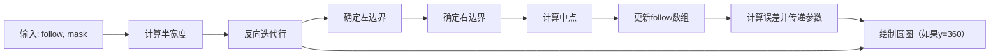

# 智能车

## 整体构思

### 功能与实现

- 基于opencv线检测自动识别道路
- 基于电机霍尔编码器计算里程
- 基于PID算法差速转向控制小车

### 硬件选型

主控：树莓派3b(国产替代作为亮点可采用香橙派)，如果以后走降本增效方案可使用OpenMV开发板

电机：MG513直流减速电机(带霍尔编码器)

电机驱动模块：基于TB6612芯片

摄像头：树莓派摄像模组v2(缺点为帧率较低)

### 软件环境

系统镜像：树莓派官方桌面镜像

开发语言：python3(依赖为opencv-python，可以参考requirements.txt)

远程调试：VNC远程连接，tailscale内部组网(可选)

### 算法实现

演示时进入根目录运行```python synthesis.py```即可

#### 车道拟合任务

采用opencv库进行图像的采集，不单独列出

独立测试代码参考含有"detect_line"字样的python文件，采用中线拟合车道的方法

边界确定通过识别距离图像中间最近的黑色像素实现，不会可chat



#### 电机控制任务

独立测试代码参考含有"motor"字样的python文件，采用调节PWM占空比控制，不会可上CSDN搜


## 工作流

硬件电路搭建-->配置树莓派系统镜像-->部署远程调试工具-->配置开发环境-->远程调试

### 电路拓扑图

上位：树莓派3b

下位：电机驱动

上下位独立供电，以防电压紊乱


| 树莓派物理引脚      | 功能             | 引脚    | 引脚    | 功能          | 树莓派物理引脚   |
|----------------|--------|--------|--------------|----------------|----------------|
| 3    | A控制信号输入     | PWMA   | VM     | 电机驱动电压输入端（4.5V-13.5V） | \ |
| 5    | A电机输入端2     | AIN2   | VCC    | 逻辑电平输入端（2.7V-5.5V）      | \    |
| 7    | A电机输入端1     | AIN1   | GND    | 接数字地                       | GND                    |
| 11 | 正常工作/待机状态控制端 | STBY   | AO1    | A电机输出端1                   | 左电机               |
| 13   | B电机输入端1     | BIN1   | AO2    | A电机输出端2                   | 左电机                |
| 15   | B电机输入端2     | BIN2   | BO2    | B电机输出端2                   | 右电机                |
| 19 | B控制信号输入端   | PWMB   | BO1    | B电机输出端1                   | 右电机                |
| 20,接驱动    | 接模拟地          | PGND1  | PGND2  | 接模拟地                       | 20,接驱动            |
| 16 | 编码器1A(实际未采用) | E1A | E2A | 编码器2A(实际未采用) | 22 |
| 18 | 编码器1B(实际未采用) | E1B | E2B | 编码器2B(实际未采用) | 24 |


## 调试方法

### 利用HDMI接显示屏，获得IP来远程连接

- 进入树莓派桌面，右上角有wifi选项，连上校园网或你自己的热点
- 右上角VNC图标，点击，找到自己树莓派的IP地址
- 另一种找IP的方式是打开左上角的终端(也可以快捷键Ctrl+Alt+T)，输入```ifconfig```回车。在一串文字中找到wlan0字样，下面的ipv4就是ipv4的地址
- 打开自己用来远程登陆电脑中的VNCViewer或Putty(这个工具没有图形界面)，输入IP地址，连接
- 树莓派系统账户叫rat,密码也是rat
- 登入后就可以拔掉显示屏的HDMI线了
- 每次关机超过24h都要重新进行这一步，因为IP地址会变

### 运行程序(尽量严格遵守)

注意在终端中按下Ctrl+C可以终止进程，一有异常及时按

输入文件名或文件夹名时按Tab能在本文件夹下搜索，自动补全

- 切换目录：打开终端后输入```cd smartcar```进入文件夹
- 运行电机测试防止意外：输入```python motor_test.py```，如果电机能跑那么直接终止进程
- 在上述操作完成后，直接输入```python synsthesis.py```跑就行
- 要调整设定距离，可点击```synsthesis.py```文件，按下Ctrl+F搜索target，改后面的系数即可，有注释
- PID只用了P，其他的效果不好，具体可chat
- 若要演示视觉调试，可以运行```detect_line_camera.py```，里边有些注释项可以取消，会有不同的窗口，例如二值化后的图和中线拟合图

